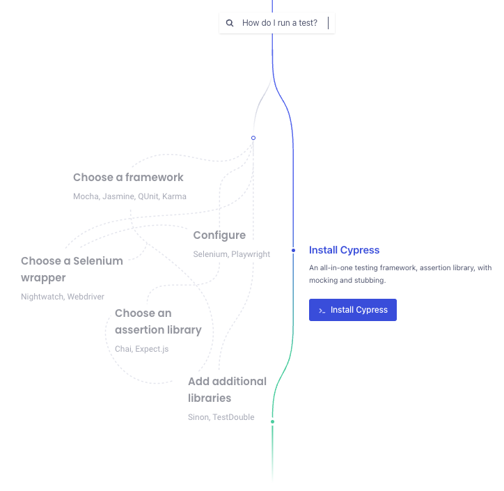

Certainly! Here's the updated README.md with the added image:

# Cypress with Node.js/TypeScript

Cypress is a powerful end-to-end testing framework for web applications that has quickly become the most developer-loved automated testing framework. It offers a unique approach and several distinct advantages over other testing frameworks:

1. **Cypress does not use Selenium**: Unlike most end-to-end testing tools, Cypress is not Selenium-based. It has a new architecture designed from the ground up, executing in the same run-loop as your application. This eliminates the need for remote commands over the network.

2. **Focus on end-to-end testing**: Cypress specializes in providing an exceptional experience for writing end-to-end tests for web applications. It is not a general automation framework or a unit testing framework for back-end services.

3. **Works with any front-end framework or website**: Cypress can test anything that runs in a web browser, whether it's a modern JavaScript framework like React, Angular, Vue, or an older server-rendered page or application.

4. **Tests are written in JavaScript**: Cypress tests are written exclusively in JavaScript. While you can compile down to JavaScript from other languages, the test code is executed directly inside the browser.

5. **All-in-one solution**: Cypress combines multiple tools into a single framework, eliminating the need to install and configure various separate tools and libraries. It integrates tools like Mocha, Chai, and Sinon seamlessly.

6. **For developers and QA engineers**: Cypress aims to make test-driven development a reality for end-to-end testing. It empowers developers and QA engineers to write tests as they build the application, promoting a faster and more reliable development process.

7. **Significantly faster execution**: The architectural improvements in Cypress enable faster test execution, allowing for test-driven development with full end-to-end tests. Cypress provides real-time feedback, access to developer tools, and immediate updates, making development and testing happen simultaneously. Cypress Cloud offers parallelization and automated load balancing for even faster test speeds.



## Usage with Node.js/TypeScript

To use Cypress with Node.js and TypeScript, follow the installation, configuration, and testing steps mentioned in the previous sections.

## Example

Here's a simple example of a Cypress test written in TypeScript:

```typescript
describe('Login', () => {
  it('should successfully log in', () => {
    cy.visit('/login');

    cy.get('input[name="username"]').type('john_doe');
    cy.get('input[name="password"]').type('password123');

    cy.get('button[type="submit"]').click();

    cy.url().should('include', '/dashboard');
    cy.get('.welcome-message').should('contain', 'Welcome, John Doe!');
  });
});
```

In this example, we have a test that verifies the successful login functionality of an application. Cypress provides a fast and efficient way to write expressive tests using its powerful API.

For more information on Cypress and its features, refer to the official [Cypress documentation](https://docs.cypress.io/). It provides detailed guides, API references, and examples to help you leverage Cypress effectively in your testing workflow.

If you have any questions or need support, the Cypress community is active and responsive, offering assistance and sharing best practices. Happy testing with Cypress!