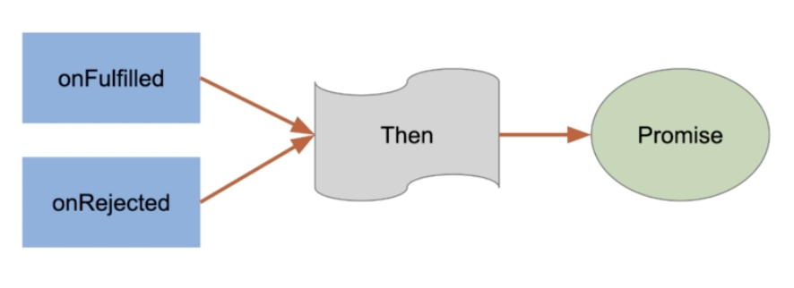

# javascript promises

JavaScript Promises Practice
Welcome to the JavaScript Promises Practice repository! This repository contains a collection of short scripts that demonstrate the usage of JavaScript promises. These scripts serve as practice exercises to help you understand and master working with promises in JavaScript.

What are Promises?
Promises are a powerful feature in JavaScript that allow you to handle asynchronous operations in a more organized and manageable way. Promises provide a way to write cleaner and more readable code when dealing with asynchronous tasks such as API calls, file operations, and more.

Repository Structure
The scripts in this repository are organized into separate files, each focusing on a specific aspect of working with promises. You can explore these files to gain a better understanding of how promises work and how to leverage their features in your own JavaScript projects.

How to Use
To get started, simply navigate to the desired script file and open it in your preferred JavaScript environment or browser console. Each script is self-contained and demonstrates a specific use case or concept related to promises.

Promises in JavaScript have different status (pending, fulfilled, or rejected)

In JavaScript promises, the then() method is used to handle the fulfillment of a promise, and it takes two callback functions as arguments: the first one is for handling the successful fulfillment (onFulfilled), and the second one is for handling any errors or rejections (onRejected)

You can study the code and experiment with different variations to deepen your understanding of promises. Feel free to modify the scripts or create your own variations to practice and explore further.

Contributions
Contributions to this repository are welcome! If you have a script that demonstrates a unique use case or a concept related to promises, feel free to submit a pull request. Make sure to follow the contribution guidelines outlined in the repository's CONTRIBUTING.md file.

License
This repository is licensed under the MIT License. Feel free to use the scripts for learning purposes, personal projects, or any other non-commercial uses.

Feedback and Support
If you have any questions, suggestions, or need support while working with the scripts, please feel free to open an issue in the repository. Your feedback is valuable and helps improve the quality of the practice scripts.

Happy coding with JavaScript promises!
